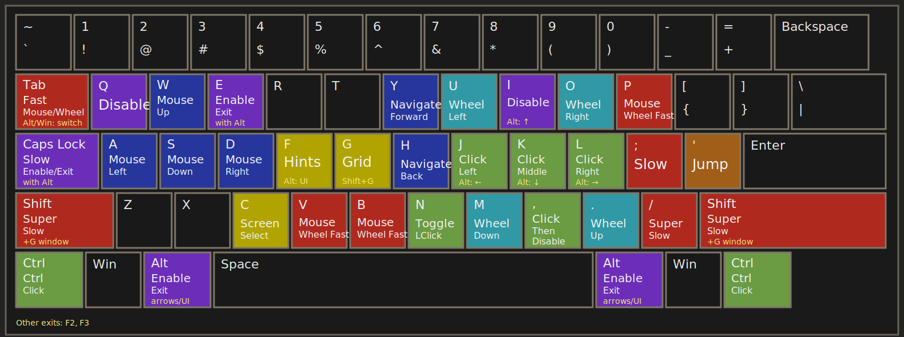

# User custom configuration for mousemaster ([user-custom.properties](user-custom.properties))

(Refer to [configuration-reference.md](configuration-reference.md) for documentation on the complete list of configuration properties.)

## Overview

- Press _alt + e_ or _alt + capslock_ to activate.
- Press _w_, _a_, _s_, _d_ to move the mouse.
- Press _q_ or _i_ to deactivate. Holding _alt_ turns _i_, _j_, _k_, _l_ into arrow keys instead.
- The active keyboard layout is forced to _us-qwerty_ to prevent focus changes from reloading the configuration.

## Normal Mode (hold _alt_ then press _e_, or hold _alt_ then press _capslock_)

- Press mouse buttons with _m_ (left button), _,_ (middle button), _._ (right button).
- Toggle left mouse button with _n_.
- Click then deactivate with _b_.
- Scroll vertically with _j_ (down) and _k_ (up).
- Scroll horizontally with _h_ (left) and _l_ (right).
- Jump forward (teleport) by holding _'_ while moving.
- Slow down mouse and scroll movement by holding _capslock_ or _;_ while moving.
- Super slow down mouse and scroll movement by holding _shift_ or _/_ while moving.
- Accelerate mouse and scroll movement by holding _tab_, _p_, or _v_. _Ctrl_ shortcuts, _Alt + Tab_, _Win + Tab_, _Shift + Enter_, and _Win + Shift + S_ are passed through.

## Key remappings
- Press _alt + ijkl_ to simulate the arrow keys.
- Navigate back and forward using _t_ (back) and _y_ (forward). These keys send 
_leftalt + leftarrow_ (for back) and _leftalt + rightarrow_ (for forward) to the active application. 

## Grid Mode (_g_ in normal mode)

- Divide screen into a 2x2 grid, refining target area with each key press.
- Move mouse to the middle of the targeted grid section.
- Shrink the grid in one direction with _w_, _a_, _s_, _d_.
- Go back to normal mode with _g_ or _esc_.

## Window Mode (hold _shift_, press _g_, keep holding _shift_)

- While still holding _shift_, move mouse to the active window's edges with direction keys.
- While still holding _shift_, move mouse to the center of the active window with _g_.
- Go back to normal mode by releasing _shift_.

## Hint Mode (_f_ in normal mode)

- Display labels on the screen for direct mouse warping.
- Similar to Vimium-like browser extensions, but applicable to the entire screen.
- Trigger a second hint pass with a smaller hint grid centered around the mouse by holding _shift_ while selecting a hint.
- Undo an accidental key press with _backspace_.
- A balance between hint size, number and screen space is crucial and can be configured: see `hint.font-size`, `hint.grid-max-column-count`, and `hint.grid-cell-width` in [user-custom.properties](user-custom.properties).
- Go back to normal mode with _esc_ or _backspace_.

## UI Hint Mode (hold _alt_ then press _f_ in normal mode)

- Display labels on interactive UI elements (buttons, links, etc.) of the active window.
- Select a hint to move the mouse to that UI element.
- Undo an accidental key press with _backspace_.
- Go back to normal mode with _esc_ or _backspace_.

## Screen Selection Mode (_c_ in normal mode)

- Display one large hint label on each screen for quickly moving from one screen to another.
- Go back to normal mode with _c_, _esc_ or _backspace_.

## Center Mouse after Alt-Tab

- After using Alt-Tab to switch windows, the mouse is automatically centered on the newly active window.
- This works by detecting the Alt-Tab combo, waiting for _leftalt_ or _rightalt_ to be released, then waiting for the Alt-Tab menu (Explorer.EXE) to lose focus before centering the mouse.
